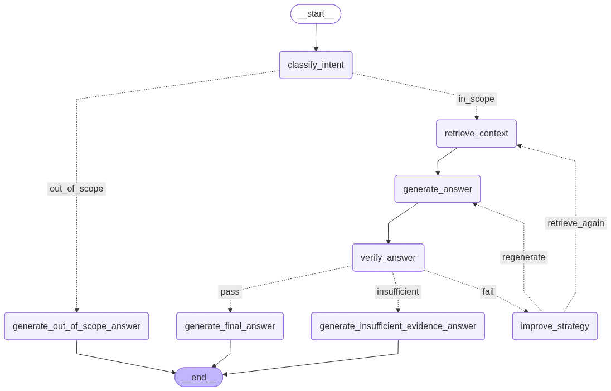
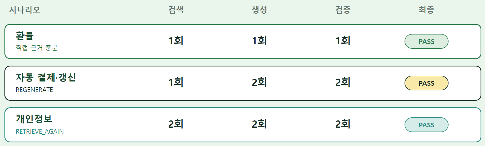

# FinePrint Agent
### LangGraph 기반 근거 검증 및 실패 복구 흐름 설계
: 검색된 근거와 생성 답변의 일치 여부를 검증하고, 실패 원인에 따라 재생성·재검색·근거 부족 안내로 분기하는 Agent를 설계했습니다.

## 1. 담당 역할
**LangGraph 기반 근거 검증 Agent 흐름 설계 및 구현**

- 사용자 질문의 지원 범위 및 문제 유형 분류
- Hybrid RAG 검색 결과를 Agent State에 연결
- 검색 근거를 활용한 답변 생성
- 생성 답변과 근거의 일치 여부 검증
- 실패 원인에 따른 `REGENERATE`·`RETRIEVE_AGAIN` 분기
- 최대 재시도 제한과 근거 부족 안내 경로 구현

## 2.  관련 파일

파일 구조
```
msh/
├─ agent/
│  ├─ README.md
│  ├─ __init__.py
│  ├─ nodes.py
│  ├─ schemas.py
│  ├─ state.py
│  └─ workflow.py
├─ rag_adapter.py
├─ requirements.txt
└─ test_agent.py
```

- `agent/workflow.py`: LangGraph 흐름 및 조건부 분기 구성
- `agent/nodes.py`: 의도 분류, 답변 생성, 검증 노드 구현
- `agent/state.py`: Agent 상태 정의
- `agent/schemas.py`: 구조화 출력 스키마 정의
- `../rag_adapter.py`: RAG 검색 결과를 Agent 입력 형식으로 연결
- `../test_agent.py`: Agent 통합 실행 및 테스트

## 3. Agent 동작 흐름

사용자 질문의 지원 범위와 문제 유형을 분류한 뒤,  
서비스 약관과 소비자 보호 근거를 검색해 초안 답변을 생성합니다.

생성된 답변은 별도의 검증 노드에서 실제 검색 근거와 일치하는지 확인하며,  
검증 결과와 실패 원인에 따라 최종 답변·재생성·재검색·근거 부족 안내 경로로 분기합니다.


- `PASS`: 근거와 답변이 일치하면 최종 답변 생성
- `REGENERATE`: 근거는 충분하지만 표현이 부정확하면 답변만 재생성
- `RETRIEVE_AGAIN`: 판단 근거가 부족하면 검색 전략을 보완해 재검색
- `INSUFFICIENT`: 최대 재시도 후에도 근거가 부족하면 확인사항과 필요 자료 안내
- `OUT_OF_SCOPE`: 지원 범위를 벗어난 질문은 별도 안내 후 종료

## 4. State 구조

FinePrint는 질문 분류부터 근거 검색, 답변 검증, 재시도 이력까지  
하나의 `FinePrintState`에서 관리하도록 설계했습니다.

State는 크게 다음 다섯 영역으로 구성됩니다.

| 영역 | 주요 필드 | 역할 |
|---|---|---|
| 사용자 입력 | `service_name`, `user_question`, `policy_urls` | 서비스와 문제 상황, 사용자 지정 공식 URL 저장 |
| 의도 분류 | `primary_intent`, `related_intents`, `is_in_scope` | 문제 유형과 지원 범위 판단 |
| 검색 근거 | `terms_context`, `consumer_protection_context`, `knowledge_base_status` | 약관·소비자 보호 검색 결과와 DB 상태 저장 |
| 생성·검증 | `draft_answer`, `verification_status`, `missing_evidence`, `suggested_action` | 초안 답변과 검증 결과, 실패 원인 관리 |
| 재시도·출력 | `improvement_instruction`, `retry_count`, `round_logs`, `final_answer` | 개선 지시, 반복 횟수, 실행 이력, 최종 답변 관리 |

<details>
<summary><strong>FinePrintState 전체 코드 보기</strong></summary>

```python
class FinePrintState(TypedDict):
    service_name: str
    user_question: str
    policy_urls: dict[str, str]

    primary_intent: str
    related_intents: list[str]
    is_in_scope: bool

    terms_context: str
    consumer_protection_context: str
    knowledge_base_status: dict

    draft_answer: str

    verification_status: str
    verification_reason: str
    missing_evidence: str
    suggested_action: str

    improvement_instruction: str
    retry_count: int
    round_logs: Annotated[list[dict], add]

    final_answer: dict
```
### 설계 포인트

- 모든 노드가 동일한 State를 읽고 필요한 필드만 갱신하도록 구성
- `retry_count`로 최대 재시도 횟수를 제어(2회로 설정함)
- `round_logs`에 각 검색·생성·검증 라운드의 결과를 누적
  - `round_logs`는 LangGraph reducer를 이용해 각 라운드의 로그를 덮어쓰지 않고 리스트에 누적합니다.
- `missing_evidence`와 `suggested_action`을 다음 재시도 전략에 활용
- `final_answer`는 UI에서 바로 사용할 수 있도록 구조화된 형태로 저장

</details>

## 5. 주요 노드 및 조건부 분기

### 주요 노드

| 노드 | 역할 |
|---|---|
| `classify_intent` | 사용자 질문의 주요·연관 의도를 분류하고 FinePrint의 지원 범위에 해당하는지 판단 |
| `retrieve_context` | 서비스 약관과 소비자 보호 자료를 Hybrid RAG로 검색하고 검색 결과와 실행 로그를 State에 저장 |
| `generate_answer` | 검색된 근거와 이전 검증의 개선 지시를 바탕으로 1차 답변 생성 |
| `verify_answer` | 답변의 핵심 주장이 검색 근거와 일치하는지 검증하고 후속 행동을 결정 |
| `improve_strategy` | 검증 실패 사유를 바탕으로 다음 검색 또는 답변 생성 단계에 적용할 개선 지시 생성 |
| `generate_final_answer` | 검증을 통과한 초안을 사용자에게 제공할 구조화된 최종 답변으로 변환 |
| `generate_insufficient_evidence_answer` | 재시도 후에도 근거가 부족할 경우 확인된 사실과 미확인 정보를 구분하여 안내 |
| `generate_out_of_scope_answer` | FinePrint의 지원 범위를 벗어난 질문에 안내 메시지를 제공하고 종료 |

각 노드는 `FinePrintState`를 통해 질문 분류 결과, 검색 근거,
생성 답변, 검증 결과와 재시도 정보를 공유합니다.

### 조건부 분기

| 분기 함수 | 판단 기준 | 이동 경로 |
|---|---|---|
| `route_scope` | `is_in_scope` 값 | 지원 범위이면 `retrieve_context`, 범위 밖이면 `generate_out_of_scope_answer` |
| `route_verification` | `verification_status`와 `retry_count` | 검증 통과, 개선 재시도 또는 근거 부족 답변으로 분기 |
| `route_improvement` | `suggested_action` 값 | 답변 재생성 또는 근거 재검색 경로 선택 |

| 분기 결과 | 조건 | 다음 노드 |
|---|---|---|
| `in_scope` | `is_in_scope == True` | `retrieve_context` |
| `out_of_scope` | `is_in_scope == False` | `generate_out_of_scope_answer` |
| `pass` | `verification_status == "PASS"` | `generate_final_answer` |
| `fail` | 검증 실패이며 `retry_count < 2` | `improve_strategy` |
| `insufficient` | 검증 실패이며 `retry_count >= 2` | `generate_insufficient_evidence_answer` |
| `regenerate` | `suggested_action == "REGENERATE"` | `generate_answer` |
| `retrieve_again` | 그 외의 개선 행동 | `retrieve_context` |

검증에 실패하면 먼저 `improve_strategy`에서 다음 단계에 적용할
구체적인 개선 지시를 생성합니다.

이후 `suggested_action`이 `REGENERATE`이면 기존 검색 근거를 유지한 채
답변만 다시 생성하고, 그 외에는 개선된 검색 지시를 반영해
약관과 소비자 보호 근거를 다시 검색합니다.

재시도 횟수가 2회에 도달한 뒤에도 검증을 통과하지 못하면
무한 반복을 방지하기 위해 근거 부족 안내 경로로 종료합니다.

## 6. 핵심 설계 포인트
① 답변 생성과 근거 검증 분리
   - 답변 생성 모델이 스스로 자신의 답변을 확인하도록 하지 않고,
   - `generate_answer`와 `verify_answer`를 별도 노드로 분리함
  
   > 이를 통해 생성된 답변이 검색 근거보다 강하게 단정하거나 근거에 없는 내용을 추가했는지를 독립적으로 검증하도록 구성함

② 검증 실패 원인에 따른 복구 경로 분리
   검증 실패를 모두 동일하게 처리하지 않고 두 가지로 구분했습니다.  
   - 근거는 충분하지만 답변 표현에 문제가 있는 경우 : `REGENERATE`    
   - 질문에 답하기 위한 근거 자체가 부족한 경우 : `RETRIEVE_AGAIN`
  
   > 이를 통해 답변만 고치면 되는 상황에서 불필요하게 문서를 다시 검색하거나, 근거가 부족한데 같은 답변만 반복 생성하는 문제를 줄임

③ 재시도 제한 설정
   - 검증 실패가 반복될 경우 `retry_count` 증가시킴  
   - 설정된 횟수에 도달하면 `INSUFFICIENT` 경로로 종료하도록 설계함

   > 그래프가 무한 반복되는 것을 방지하기 위한 설정임  
     
④ 근거 부족도 하나의 최종 결과로 처리
   - 근거를 찾지 못한 경우에도 단순 오류로 종료하지 않고,
   - 현재 확인된 사실, 추가로 필요한 정보, 고객센터 문의 시 준비할 자료를 안내하도록 함

   > **'답을 생성하지 못함'** 이 아닌 **'근거가 부족하다는 사실을 안전하게 전달'** 하는 답변 제공하도록 설계함

⑤ 판단용 모델과 생성용 모델 설정 분리
   - 판단 작업에는 일관성이 중요함
     - 의도 분류와 검증 모델 `temperature`를 0으로 설정
   - 답변 생성과 개선 지시에는 표현의 자연스러움 필요
     - 답변 생성과 개선 지시 작성 모델 `temperature`를 0.3으로 설정   

## 7. 문제 분석 및 개선 과정
### 1. 검색 근거보다 강한 결론을 생성하는 문제

**문제**  
초기 테스트에서는 검색된 약관에 직접적인 환불 근거가 부족한데도  
“전액 환불이 가능하다”와 같이 확정적인 답변이 생성되는 경우가 있었습니다.

**원인**  
답변 생성 모델이 검색 근거뿐 아니라 일반적인 지식이나 가능성을 함께 사용하면서,  
근거에 명시되지 않은 조건과 결론을 추가했습니다.

**개선**  
- 답변의 핵심 주장이 검색 근거에서 직접 확인되는지 별도의 검증 노드에서 확인
- 환불·보상 가능성을 근거보다 강하게 표현하면 검증 실패 처리
- 사용자의 진술을 확인된 사실처럼 단정하지 않도록 생성 및 검증 프롬프트 강화
- 근거에 조건이 명시된 경우에만 조건부 형태로 안내하도록 제한

**결과**  
근거에 없는 환불 가능성이나 문제 원인을 임의로 추정하는 답변을 줄이고,  
확인된 조건과 추가로 확인해야 할 사실을 구분해 안내할 수 있도록 개선했습니다.


### 2. 모든 검증 실패를 동일하게 처리하는 문제

**문제**  
초기 구조에서는 검증에 실패한 경우 실패 원인과 관계없이  
동일한 방식으로 답변을 다시 생성하거나 검색을 반복했습니다.

**원인**  
답변 표현의 문제와 검색 근거 부족 문제를 하나의 실패 유형으로 처리했기 때문입니다.

**개선**  
검증 실패 원인에 따라 후속 행동을 두 가지로 분리했습니다.

- `REGENERATE`: 근거는 충분하지만 답변의 표현이나 조건이 부정확한 경우
- `RETRIEVE_AGAIN`: 질문에 답하기 위한 핵심 근거 자체가 부족한 경우

`verify_answer`에서 후속 행동을 결정하고,  
`improve_strategy`에서 다음 단계에 적용할 구체적인 개선 지시를 생성하도록 역할을 분리했습니다.

**결과**  
답변만 수정하면 되는 상황에서는 기존 근거를 유지하고,  
근거가 부족한 상황에서만 검색을 다시 수행해 불필요한 반복을 줄였습니다.


### 3. 사용자 질문과 관련 없는 내용으로 답변이 확장되는 문제

**문제**  
해지 질문에 환불 조건을 함께 설명하거나,  
결제 질문에 해지와 구독 취소 내용을 추가하는 등  
사용자가 묻지 않은 문제까지 답변이 확장되는 경우가 있었습니다.

**원인**  
검색 결과에 여러 문제 유형의 문서가 함께 포함되고,  
생성 모델이 관련된 정보를 모두 답변에 넣으려는 경향이 있었기 때문입니다.

**개선**  
- 질문의 핵심 문제를 `primary_intent`로 분류
- 문제 유형별 답변 작성 지침을 별도로 정의
- 사용자가 직접 묻지 않은 환불·해지·결제 항목은 답변에서 제외
- 검색된 문서라도 질문과 직접 관련되지 않으면 최종 근거와 출처에서 제외
- 확인사항과 다음 행동도 현재 문제 유형에 관련된 내용만 생성하도록 제한

**결과**  
답변의 범위를 사용자 질문에 맞게 유지하고,  
불필요한 정보가 포함되어 핵심 안내가 흐려지는 문제를 개선했습니다.


### 4. 최종 답변 생성 단계에서 새로운 내용이 추가되는 문제

**문제**  
1차 답변이 검증을 통과하더라도,  
최종 답변을 구조화하는 과정에서 새로운 절차나 권리,  
근거에 없는 출처가 추가될 가능성이 있었습니다.

**원인**  
최종 답변 생성 역시 LLM이 수행하기 때문에,  
검증된 초안을 정리하는 범위를 넘어 새로운 내용을 생성할 수 있었습니다.

**개선**  
- 최종 답변 생성의 역할을 검증된 초안의 구조화와 쉬운 표현으로 제한
- 검증된 초안의 의미 범위를 넘어 새로운 결론을 추가하지 않도록 명시
- `terms_evidence`에는 검색된 약관 원문에서 직접 관련된 문장만 사용
- 여러 근거를 합쳐 새로운 근거 문장을 생성하지 않도록 제한
- 실제 답변에 사용한 문서만 `source_references`에 포함
- 내부 파일 경로나 데이터베이스 경로는 사용자에게 노출하지 않도록 처리

**결과**  
검증 이후 최종 출력 단계에서도 근거의 의미가 변형되거나  
새로운 사실이 추가되는 위험을 줄였습니다.

> 반복 테스트를 통해 단순히 프롬프트를 보완하는 데 그치지 않고,  
> 생성·검증·개선·재시도 단계를 분리해 실패 원인에 따라 다른 경로로 복구하도록 개선했습니다.  
> 이를 통해 답변의 자연스러움보다 검색 근거와의 일치성과 안전한 안내를 우선하도록 설계했습니다.

## 8. 테스트 결과
환불, 자동결제·갱신, 개인정보 시나리오를 대상으로  
검증 실패 원인에 따른 분기와 복구 경로가 의도한 대로 동작하는지 확인했습니다.



| 시나리오 | 실행 경로 | 결과 |
|---|---|---|
| 환불 | 검색 1회 → 생성 1회 → 검증 1회 | 첫 검증에서 `PASS` |
| 자동결제·갱신 | 검색 1회 → 생성 2회 → 검증 2회 | `REGENERATE` 후 `PASS` |
| 개인정보 | 검색 2회 → 생성 2회 → 검증 2회 | `RETRIEVE_AGAIN` 후 `PASS` |

- 환불 시나리오는 처음 검색된 근거만으로 조건부 답변을 생성해 첫 검증에서 통과했습니다.
- 자동결제·갱신 시나리오는 근거는 충분했지만 답변 표현을 수정해야 해 기존 근거를 유지하고 답변만 재생성했습니다.
- 개인정보 시나리오는 초기 검색 근거가 부족해 개선된 검색 지시를 반영하여 다시 검색했습니다.

> 세 시나리오 모두 서로 다른 경로를 거쳤지만,  
> 실제 사용 근거를 포함한 최종 답변이 검증을 통과하는 것을 확인했습니다.

> 본 테스트는 대규모 정량 평가가 아니라,
> 검증 실패 원인에 따라 재생성 또는 재검색 경로가 정상적으로 동작하는지 확인한 시나리오 기반 테스트입니다.

## 9. 협업 및 통합

FinePrint는 문서 수집, RAG 검색, Agent, UI가 서로 다른 모듈로 개발되었습니다.

저는 Agent가 독립적으로 동작할 수 있도록 먼저 임시 검색 문맥을 사용해
질문 분류, 답변 생성, 검증, 재시도 흐름을 테스트했습니다.

이후 실제 RAG 모듈과 연결하기 위해 다음 입력과 출력 구조를 기준으로
팀원들과 데이터 형식을 맞췄습니다.

- 입력: `service_name`, `user_question`, `policy_urls`
- RAG 결과: `terms_context`, `consumer_protection_context`, `knowledge_base_status`
- Agent 결과: 구조화된 `final_answer`
- 실행 이력: `round_logs`, `retry_count`

최종 통합 이후에는 실제 RAG 검색 결과를 입력으로 사용해
Agent의 주요 분기와 최종 답변 생성이 정상적으로 동작하는지 확인했습니다.

## 10. 회고
이번 프로젝트를 통해 Agent는 여러 노드를 연결하는 것만으로 완성되는 것이 아니라,  
각 단계에서 발생할 수 있는 실패를 정의하고 그에 맞는 복구 경로를 설계해야 한다는 점을 배웠습니다.

특히 답변 표현의 문제와 검색 근거 부족 문제를 구분하지 않으면,  
불필요한 재검색이 발생하거나 같은 오류가 반복될 수 있었습니다.  
이를 `REGENERATE`와 `RETRIEVE_AGAIN` 경로로 분리하면서  
LangGraph의 상태 관리와 조건부 분기를 실제 문제 해결에 적용해볼 수 있었습니다.

또한 생성된 답변이 자연스러운 것만으로는 충분하지 않고,  
검색된 약관과 소비자 보호 근거의 범위를 벗어나지 않는지 검증하는 과정이 중요하다는 점을 경험했습니다.  
반복 테스트를 통해 근거보다 강한 표현, 사용자 질문 범위의 확장,  
최종 답변 단계에서 새로운 사실이 추가되는 문제를 확인하고 프롬프트와 검증 기준을 보완했습니다.

다만 최종 통합 과정에서는 모듈 통합 과정에 집중하면서 전체 연결 구조를 충분히 분석하지 못한 점이 아쉬움으로 남았습니다.
앞으로는 전체 연결 구조를 다시 분석하고, 다양한 시나리오와 정량 평가 기준을 추가해  
Agent의 검색 정확도와 근거 일치도를 더 체계적으로 검증하고 싶습니다.
